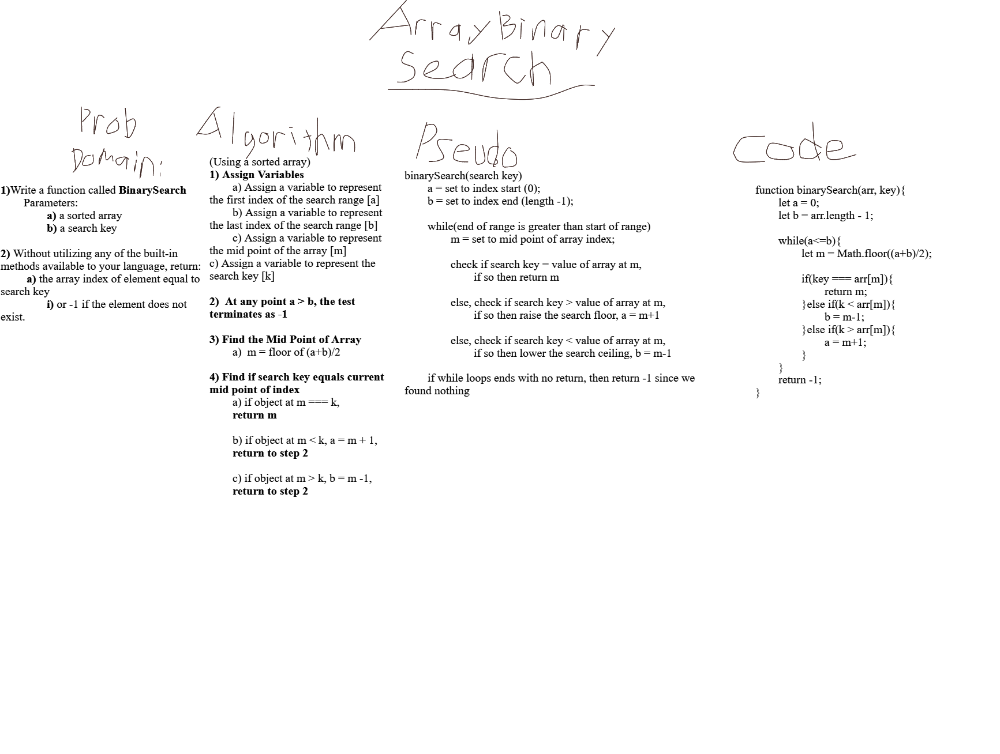

# Code Challenge 03 - Array Binary Search

- [Pull Request](https://github.com/micgreene/data-structures-and-algorithms/pull/19)

## Challenge Summary
<!-- Short summary or background information -->

## Challenge Description

- Write a function called BinarySearch
  - Parameters:
    - a sorted array
    - a search key

- Without utilizing any of the built-in methods available to your language, return:
  - the array index of element equal to search key
  **-or-**
  - -1 if the element does not exist.

## Approach & Efficiency

- Using the problem domain as a guide, first I identified the problems to solve.

- Then I researched the binary search topic via the supplied [wikipedia link](https://en.wikipedia.org/wiki/Binary_search_algorithm).

- Once I understood the basic logic, I then whiteboarded the algorithm in plain english:

(Using a sorted array)
1) Assign Variables
	a) Assign a variable to represent the first index of the search range [a]
	b) Assign a variable to represent the last index of the search range [b]
	c) Assign a variable to represent the mid point of the array [m]
c) Assign a variable to represent the search key [k]

2)  At any point a > b, the test terminates as -1

3) Find the Mid Point of Array
	a)  m = floor of (a+b)/2

4) Find if search key equals current mid point of index
	a) if object at m === k, 
	return m

	b) if object at m < k, a = m + 1,
	return to step 2

	c) if object at m > k, b = m -1,
	return to step 2

- I then started to code the problem out loosely using pseudo code:

binarySearch(search key)
	a = set to index start (0);
	b = set to index end (length -1);

	while(end of range is greater than start of range)
		m = set to mid point of array index;
		
		check if search key = value of array at m,
			if so then return m

		else, check if search key > value of array at m,
			if so then raise the search floor, a = m+1

		else, check if search key < value of array at m,
			if so then lower the search ceiling, b = m-1

	if while loops ends with no return, then return -1 since we found nothing

- Finally, I used my pseudo code as a guide to complete my full code.

## Solution

