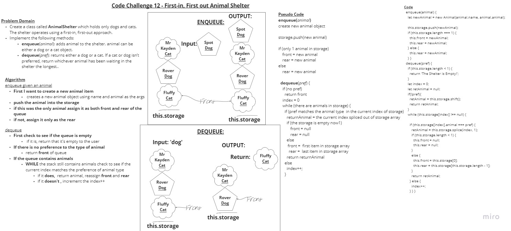

# Code Challenge 12 - First-in, First out Animal Shelter

- [Pull Request](https://github.com/micgreene/data-structures-and-algorithms/pull/26)

## First-in, First out Animal Shelter

- In this challenge, we are to create a queue class which accepts nodes that contain the property "Animal". Each node's Animal property could either be "dog" or "cat." Dequeueing can be done with a preference to dog or cat and return the node closest to the front with the preferred property.

## Challenge

- Create a class called AnimalShelter which holds only dogs and cats. The shelter operates using a first-in, first-out approach.
- Implement the following methods:
  - enqueue(animal): adds animal to the shelter. animal can be either a dog or a cat object.
  - dequeue(pref): returns either a dog or a cat. If pref is not "dog" or "cat" then return null.

## Approach & Efficiency

For this assignment I started with my 'Queue' class I created for one of the previous labs.

I replaced the 'Node' class with an 'Animal' class that contains an 'animal' property instead of a 'value.'

The enqueueing method just needs to be changed to .push(animal) instead of .push(node).

The dequeueing method required me to create a loop that checks starting from the front position of the storage array and recurses through it to the end, while the current index does not contain mathch the 'pref' animal passed as a parameter.

For this, I used a TDD method by creating scenarios for the .dequeue() method to pass and then created new functionality as I went.

I also added a 'name' property so the little buddies have some individual character! (=^･ｪ･^=)~

## API

- *None*

### Solution

