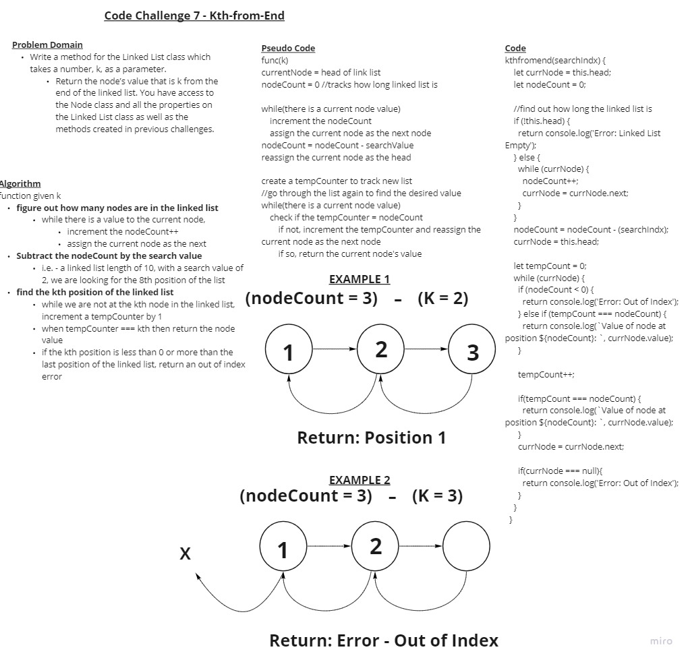

## Code Challenge 05 - Linked List Implementation

- [Pull Request](https://github.com/micgreene/data-structures-and-algorithms/pull/20)

### Singly Linked List

- In this challenge, we are to create a singly linked list. (meaning each node will posses a pointer to the next node (and its value) in the chain, but not the previous)

### Challenge

- Create a Node class that has properties for the value stored in the Node, and a pointer to the next Node.

- Within your LinkedList class, include a head property. Upon instantiation, an empty Linked List should be created.
  - Define a method called insert which takes any value as an argument and adds a new node with that value to the head of the list with an O(1) Time performance.

  - Define a method called includes which takes any value as an argument and returns a boolean result depending on whether that value exists as a Node’s value somewhere within the list.

  - Define a method called toString (or __str__ in Python) which takes in no arguments and returns a string representing all the values in the Linked List, formatted as:
    - "{ a } -> { b } -> { c } -> NULL"

- Any exceptions or errors that come from your code should be semantic, capturable errors. For example, rather than a default error thrown by your language, your code should raise/throw a custom, semantic error that describes what went wrong in calling the methods you wrote for this lab.

- Be sure to follow your language/frameworks standard naming conventions (e.g. C# uses PascalCasing for all method and class names).

### Approach & Efficiency

I decided to do TDD for this assignment.

- Instead of trying to figure out what the requirements were asking me to do, I instead looked through the list of tests.
  
- I wrote one testing case, attempted to implement code that passed itk, then moved on.

- When all cases were passing, I went back over to comment out and clean up my code.

### API

- *None* New

## Code Challenge 07 - Linked List Kth from End

- [Pull Request](https://github.com/micgreene/data-structures-and-algorithms/pull/22)

### Challenge 7

- Write a method for the Linked List class which takes a number, k, as a parameter.

  - Return the node’s value that is k from the end of the linked list. You have access to the Node class and all the properties on the Linked List class as well as the methods created in previous challenges.

### Approach & Efficiency

For this assignment I white boarded the logic, using pseudo code to understand what I was doing before I began coding.

- I first came up with the idea of using counters and 2 loops to first count the length of the linked list and then to run through it a certain number of positions.
  
- I then went back through to include edge cases like an empty linked list, a linked list with one node, searching the list with a number that is negative or too large, etc.

- I then began testing my logic against the given cases.

### API

- *None* New

### Solution

