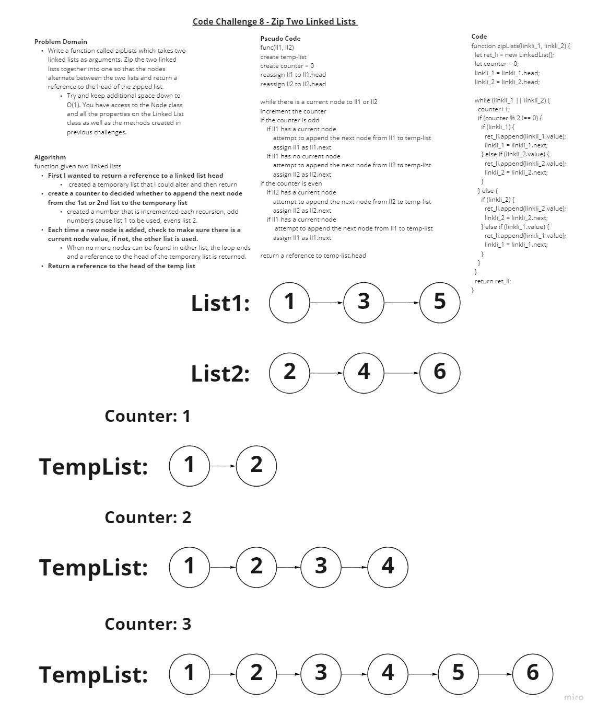

# Code Challenge 08 - Zip Two Linked Lists

## Challenge Summary

- This challenge utilizes the LinkedList.js and Node.js classes, all methods available to them are free to be used. All linked lists used are singly linked. This function is to be written in a single javascript file using the exported classes.

## Challenge Description

- Write a function called zipLists which takes two linked lists as arguments. Zip the two linked lists together into one so that the nodes alternate between the two lists and return a reference to the head of the zipped list.

- Try and keep additional space down to O(1). You have access to the Node class and all the properties on the Linked List class as well as the methods created in previous challenges.

## Approach & Efficiency

- For this challenge, I began by creating an algorithm using plain english.
  - First I determined that I wanted to return a reference to a linked list head.
    - This led me to create a temporary list that I could alter as I needed to and then return.

  - I then determined to create a counter to decided whether to add the next node from the 1st or 2nd list
    - For this I created a number that is incremented each recursion, odd numbers cause list 1 to be used, evens list 2.
  
  - Each time a new node is added, I check to make sure there is a current node value, if not, the other list is used.

  - When no more nodes can be found in either list, the loop ends and a reference to the head of the temporary list is returned.

## Solution

