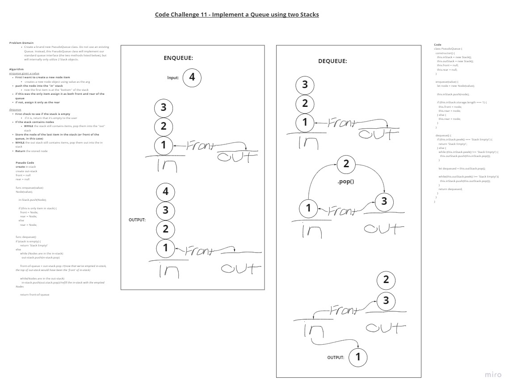

## Code Challenge 11 - Implement a Queue using two Stacks

- [Pull Request](https://github.com/micgreene/data-structures-and-algorithms/pull/25)

### Singly Linked List

- In this challenge, we are to create a new class which mimics the data structure of a queue but internally uses two stacks for data storage.

### Challenge

- Create a brand new PseudoQueue class. Do not use an existing Queue. Instead, this PseudoQueue class will implement our standard queue interface (the two methods listed below), but will internally only utilize 2 Stack objects.
- Ensure that you create your class with the following methods:

  - **enqueue(value)** which inserts value into the PseudoQueue, using a first-in, first-out approach.
  - **dequeue()** which extracts a value from the PseudoQueue, using a first-in, first-out approach.
The Stack instances have only **push**, **pop**, and **peek** methods. You should use your own Stack implementation. Instantiate these Stack objects in your PseudoQueue constructor.

### Approach & Efficiency

- For this assignment I used the whiteboard to visualize my logic.
- Imagining to open hands, I reasoned what would need to happen for a left hand holding a stack of three items to transfer the items to the right hand and retrieve the bottom item from the stack.
- I converted this anecdotal logic to pseudo code which mimics its function.
- After I had a good outline of pseudo code, I used TDD to prove each expected output of each function.

### API

- *None* New

### Solution

