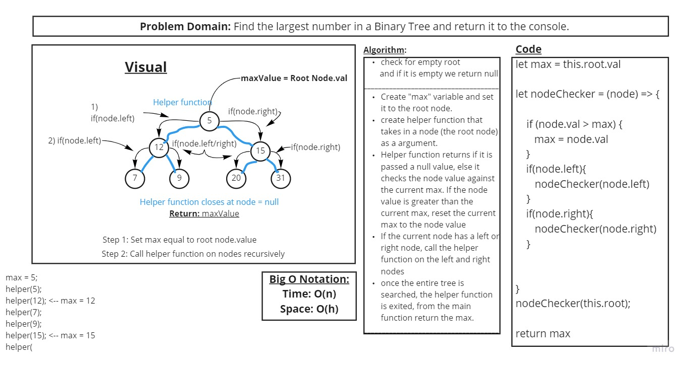
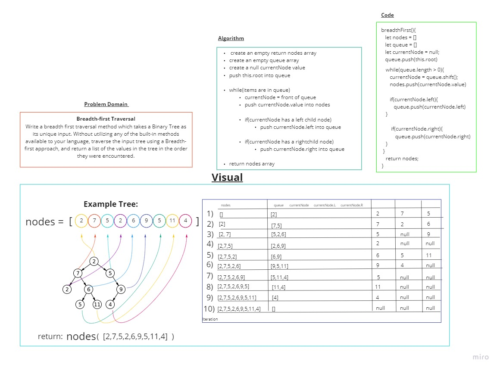

# BINARY TREE CODE CHALLENGES 15 - 17

## Code challenge 15 - Binary Tree and BST Implementation

- [Pull Request](https://github.com/micgreene/data-structures-and-algorithms/pull/30)

## Challenge

- **Create a Node class** that has properties for the value stored in the node, the left child node, and the right child node.

- **Create a BinaryTree class**
  - Define a method for each of the depth first traversals called *preOrder*, *inOrder*, and *postOrder* which returns an array of the values, ordered appropriately.
  - Any exceptions or errors that come from your code should be semantic, capturable errors. For example, rather than a default error thrown by your language, your code should raise/throw a custom, semantic error that describes what went wrong in calling the methods you wrote for this lab.

- **Create a BinarySearchTree class**
  - Define a method named *add* that accepts a value, and adds a new node with that value in the correct location in the binary search tree.
  - Define a method named *contains* that accepts a value, and returns a boolean indicating whether or not the value is in the tree at least once.

## Approach & Efficiency

The main stuggle was figuring out how to add a value to the tree. I used whiteboarding to visually create a tree and iterate my way through it.

I searched the tree in a similar way to using a binary search array:

- Each round, as long as we have not reached a null value we check to see if the number being added is less than or greater than the current value.
- If it is less than the current node value then the current node is next assigned as its left child, if not then current node is next assigned as its right child.
- When we have finally reached a null node then that means we are at the bottom of the tree and the new value can be assigned here.

## Code Challenge 16 - Find the Maximum Value in a Binary Tree

- [Pull Request](https://github.com/micgreene/data-structures-and-algorithms/pull/33)

### Challenge

- Write an instance method called find-maximum-value. Without utilizing any of the built-in methods available to your language, return the maximum value stored in the tree. You can assume that the values stored in the Binary Tree will be numeric.

### Approach & Efficiency

For this assignment I white boarded the logic, using pseudo code to understand what I was doing before I began coding.

- I knew how to walk through the tree recursively thanks to the preorder() method from previous code challenges, so that's how I traversed through the tree.

- I knew I wanted a value to keep track of what was the biggest value encountered so far, so I created a let called 'maxValue'.

- I knew this value had to be compared to everything in the tree, so I also created a let called 'currNode' to keep track of the current value to be compared.

- I decided to do this with a while loop which just keeps checking to see if there is a current node value to compare until there isn't. Then maxValue is returned.

### API

- *None*

### Solution

## Code Challenge 17 - Breadth-first Traversal

- [Pull Request](https://github.com/micgreene/data-structures-and-algorithms/pull/35)

### Challenge

- Write a breadth first traversal method which takes a Binary Tree as its unique input. Without utilizing any of the built-in methods available to your language, traverse the input tree using a Breadth-first approach, and return a list of the values in the tree in the order they were encountered.

### Approach & Efficiency

For this assignment I white boarded the logic, using pictures to clarify what was happening each iteration:

- For this challenge I tried to visualize a call stack to keep track of what was happening.

- I knew I wanted to list the value of each row of the tree from left to right, so I ensured that first the .left child would be evaluated, then the right. I accomplished this by creating an array which pushes each node encountered into it.

- I iterated through the array by creating a while loop which checks to see if the array is empty, if not then it continues through the array. When the array empties, the while loop will end and we return an array full of node values encountered.

- Inside the while loop, the node storage array then has the first item added to it removed, adds the node value to our return array, then checks to see if it first has a left child (to maintain the 'breadth' order) then a right child.

- Each node value is pushed into the queue array as this is happening in the order each is encountered.

- This ensures each node will be evaluated by the while loop until there are none remaining.

- Big O(n)
- Space(h) (h = height of binary tree)

### API

- *None*

### Solution

