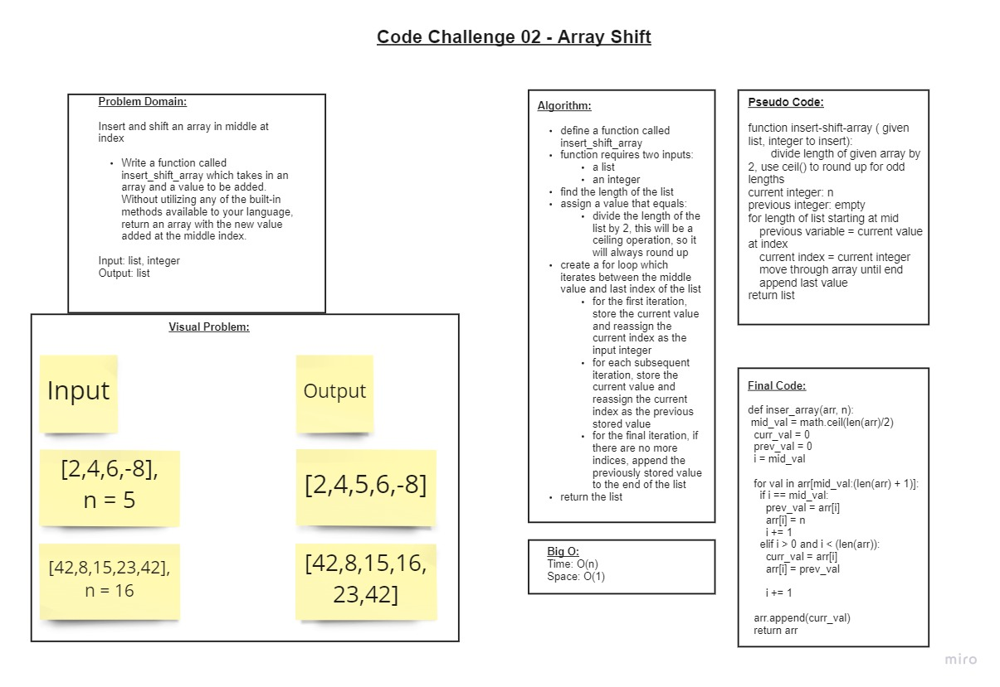

# Array Insert Shift

+ Write a function called insert_shift_array which takes in an array and a value to be added. Without utilizing any of the built-in methods available to your language, return an array with the new value added at the middle index.

## Whiteboard Process

## Approach & Efficiency

+ We started by first defining the problem domain and necessary inputs/outputs
+ We then created a visual diagram to clarify the problem we were attempting to solve.
+ We then created an algorithm to define all necessary steps
+ We then determined an approximate Big O using what we learned from the algorthim.
+ We then moved on to pseudo code, or loosely creating a typing guide for our final code.
+ Finally, were unable to figure out some of the particular methods in Python, so we used TDD to create individual unit tests in order to advance our code to completion.

## Collaborated With

+ Jordan Fleming
