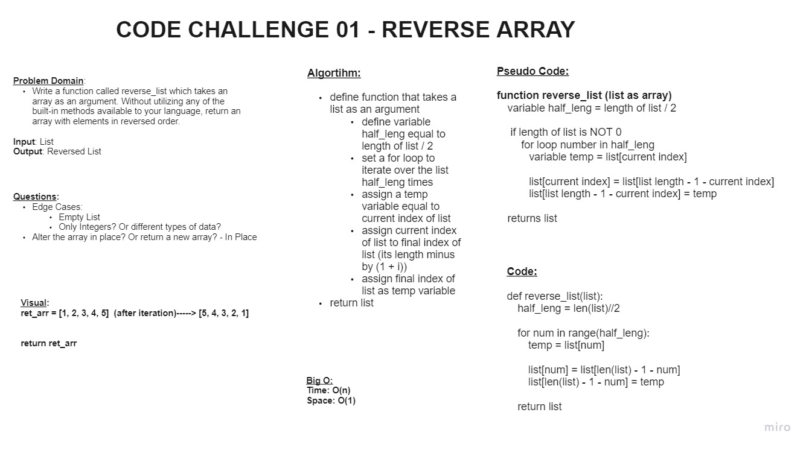

# Reverse an Array

+ Write a function called reverse_list which takes an array as an argument. Without utilizing any of the built-in methods available to your language, return an array with elements in reversed order.

## Whiteboard Process

## Approach & Efficiency

+ We started by first defining the problem domain and necessary inputs/outputs
+ We then created a visual diagram to clarify the problem we were attempting to solve.
+ We then created an algorithm to define all necessary steps
+ We then determined an approximate Big O using what we learned from the algorthim.
+ We then moved on to pseudo code, or loosely creating a typing guide for our final code.
+ Finally, we coded out the logic of our algorithm using the pseudo code as a guide for how to structure our function.

## Collaborated With

+ Minhang Xie
