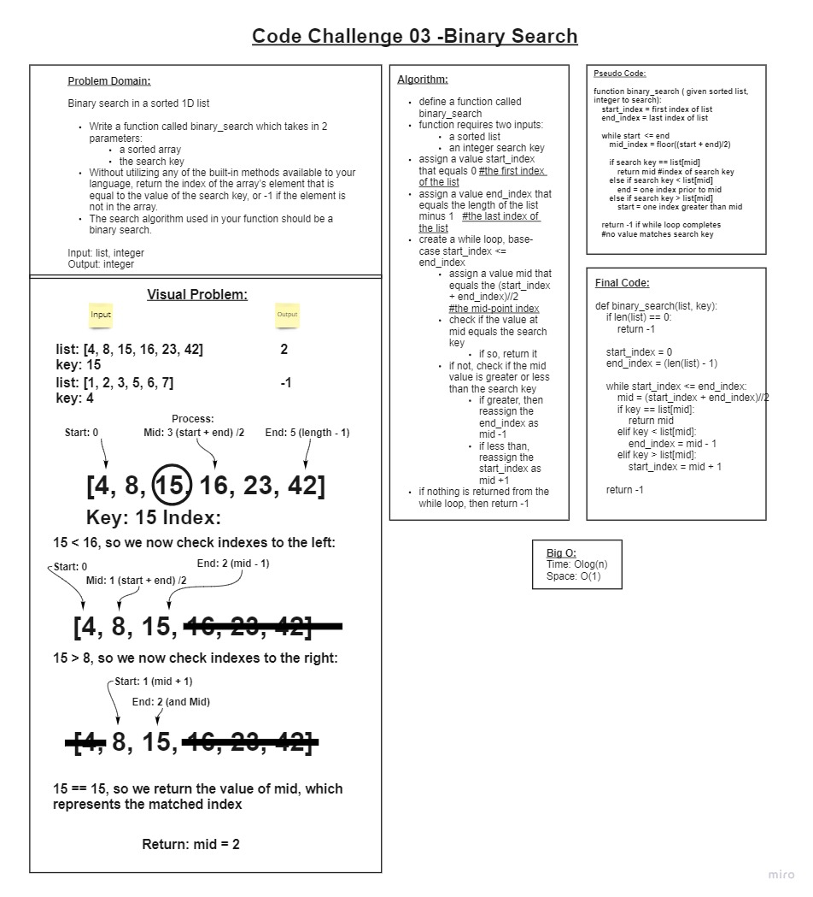

# Array Binary Search

+ Write a function called binary_search which takes in 2 parameters:
  + a sorted array
  + the search key
+ Without utilizing any of the built-in methods available to Python, return the index of the array’s element that is equal to the value of the search key, or -1 if the element is not in the array.
+ The search algorithm used is a binary search.

## Whiteboard Process

## Approach & Efficiency

+ We started by first defining the problem domain and necessary inputs/outputs
+ We then created a visual diagram to clarify the problem we were attempting to solve.
+ We then created an algorithm to define all necessary steps. I used a .gif describing the binary search to kind of visually code out exactly what was happening while I created the algorithm. This made it easier to create values as I watched the animation describe the parameters for the search.
+ We then determined an approximate Big O using what we learned from the algorthim.
+ We then moved on to pseudo code, or loosely creating a typing guide for our final code.
+ Finally, we created the final code out the logic of our algorithm using the pseudo code as a guide for how to structure our while loop.

## Collaborated With

+ Alex Payne
