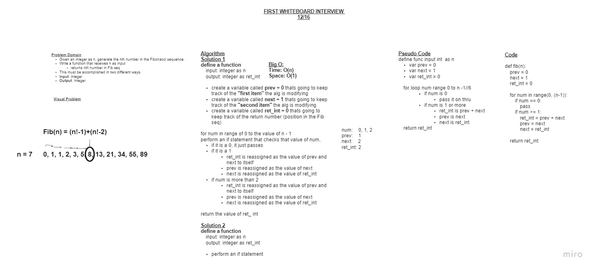

# Generate the nth Fibonacci number

+ write a function to accepts an integer, and returns the nth number in the Fibonacci sequence.
+ (Fibonacci Sequence - fib(n) = fib(n-1) + fib(n-2))

## Whiteboard Process

## Approach & Efficiency

+ I started by first defining the problem domain and necessary inputs/outputs
+ I then created a visual diagram to clarify the problem we were attempting to solve.
+ I then created an algorithm to define all necessary steps. While doing so I created a table to check the state of my variables as I went.
+ I then determined an approximate Big O using what I learned from the algorthim.
+ I then moved on to pseudo code, or loosely creating a typing guide for my final code.
+ Finally, I created the final code out the logic of our algorithm using the pseudo code as a guide for how to structure our while loop.

## Collaborated With

+ Clarissa Pamonicutt
