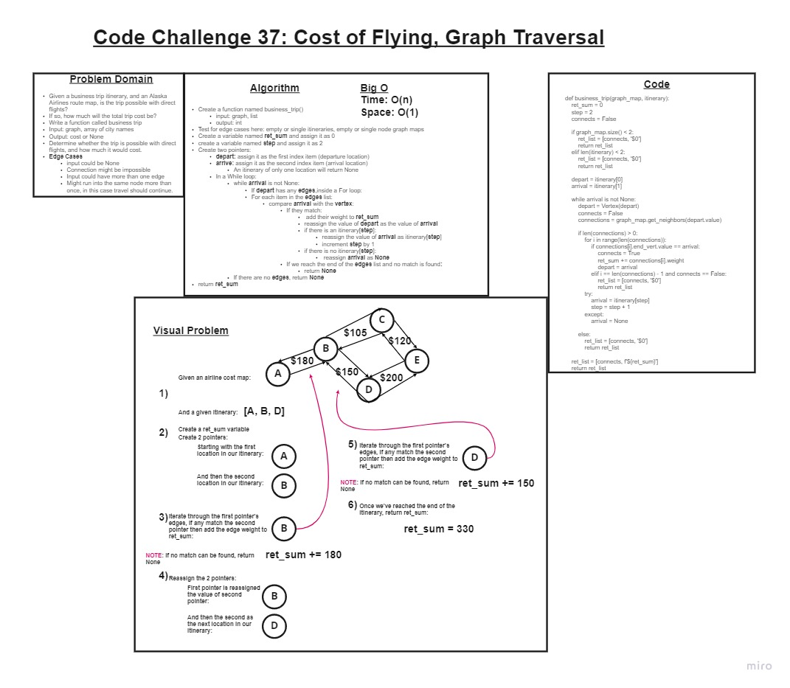

# Graph Business Trip

## Feature Tasks

+ Write a function called **business trip**
  + Arguments: graph, array of city names
  + Return: cost or null

## Whiteboard Process

### Approach & Efficiency

+ I started by creating an image on a whiteboard of a graph.
+ After visualizing the logic I would use to solve the problem, I wrote an algorithm walking me thru the general logic.
+ My main challenge was figuring out a way to refer to objects in the graph without first first having a reference to once of its nodes.
+ I had to alter my graph class somewhat to help with this challenge. :(
+ I used my algorithm to begin to code out my solution, and ran into some problems because I was not paying attention to some indentation.
+ After I figured out the necessary logic, I finished my unit testing to ensure full functionality.
