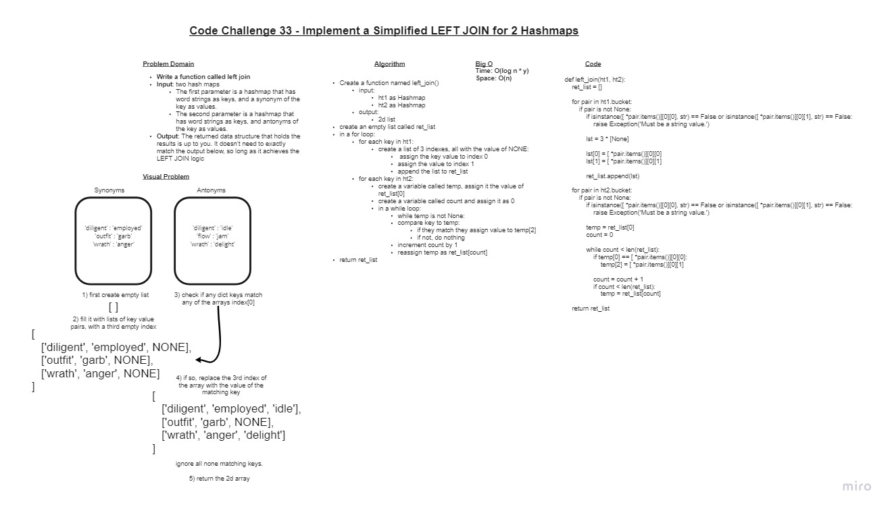

# Implement a Simplified LEFT JOIN for 2 Hashmaps

## Challenge

+ **Write a function that LEFT JOINs two hashmaps into a single data structure.**

+ Write a function called left join
  + Arguments: two hash maps
    + The first parameter is a hashmap that has word strings as keys, and a synonym of the key as values.
    +The second parameter is a hashmap that has word strings as keys, and antonyms of the key as values.
  + Return: The returned data structure that holds the results is up to you. It doesn’t need to exactly match the output below, so long as it achieves the LEFT JOIN logic
+ **NOTES:**
  + Combine the key and corresponding values (if they exist) into a new data structure according to LEFT JOIN logic.
  + LEFT JOIN means all the values in the first hashmap are returned, and if values exist in the “right” hashmap, they are appended to the result row.
  + If no values exist in the right hashmap, then some flavor of NULL should be appended to the result row.

## Whiteboard Process

### Approach & Efficiency

+ I started by creating the whiteboard. I was able to conceive most of the logic just in the visual alone.
+ I then did an algorithm describing the process I laid out in the whiteboard.
+ The main difficulty was conceiving the types of loops I would need to iterate through each value the minimum number of times. (if possible)
+ I used the same data strcture from the example for the sake of not having to make a decision otherwise.
