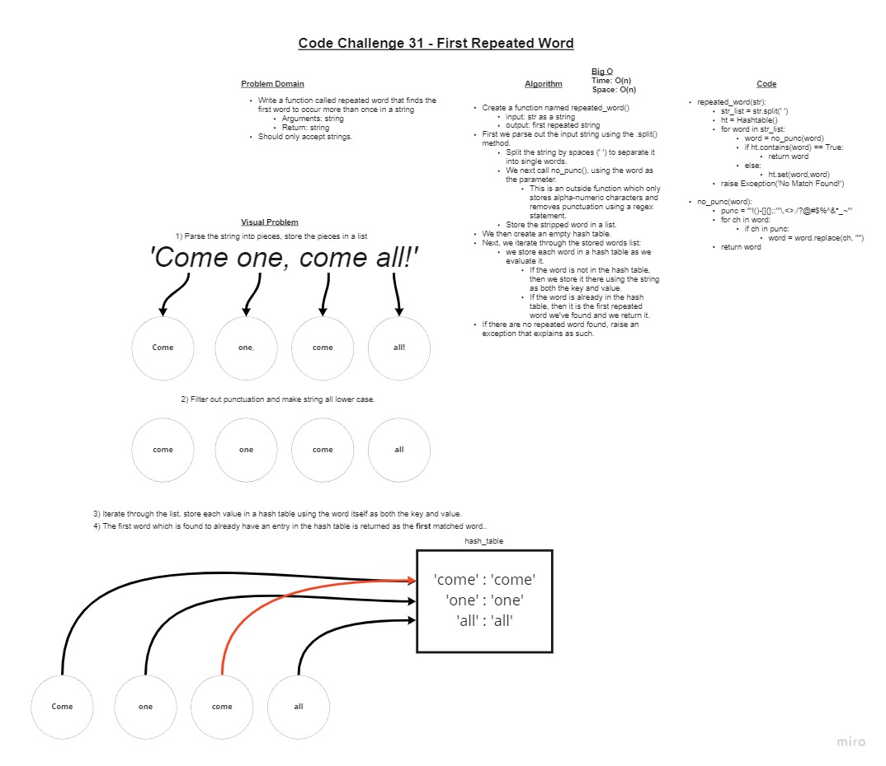

# Find the first repeated word in a book

## Challenge

+ **Write a function called repeated word that finds the first word to occur more than once in a string**
  + Arguments: string
  + Return: string

## Whiteboard Process

### Approach & Efficiency

+ I started by creating the whiteboard. I was able to conceive most of the logic just in the visual alone.
+ I then did an algorithm describing the process I laid out in the whiteboard. It made me realize I needed to refactor for a few elements as I went.
+ I then created the second function which removes punctuation from strings as it works better to have this functionality self-contained.
+ I ran several rounds of unit testing, ensuring that everything worked correctly. I ran several tests on each function to ensure they work alone as well.
