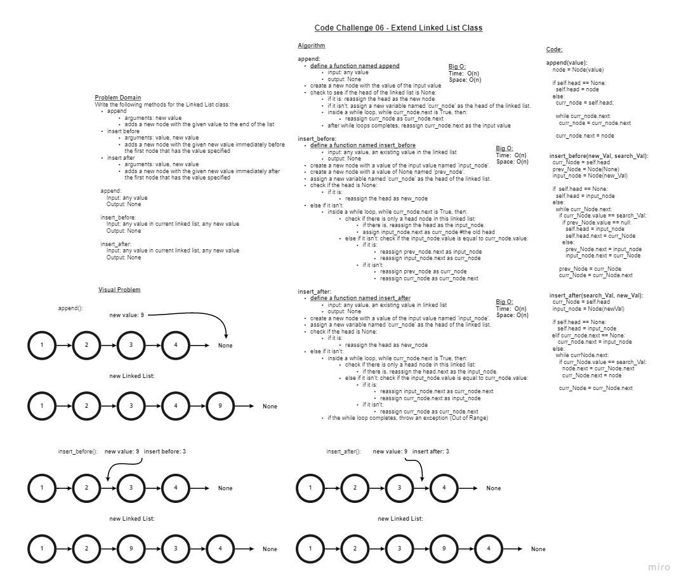
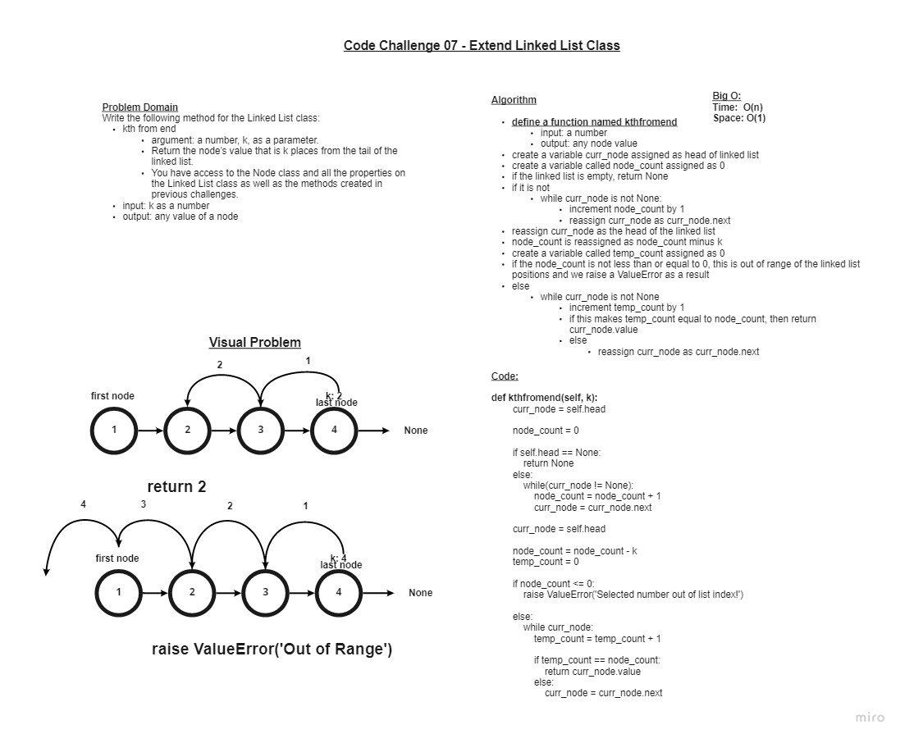

# Linked List Class

## Code Challenge 05 - Implement a Linked List

+ **Node**
  + Create a Node class that has properties for the value stored in the Node, and a pointer to the next Node.
+ **Linked List**
  + Create a Linked List class, include a head property.
  + Upon instantiation, an empty Linked List should be created.

### Challenge

+ **Node**
  + Create a Node class that has properties for the value stored in the Node, and a pointer to the next Node.
+ **Linked List**
  + Create a Linked List class
    + Within your Linked List class, include a head property.
  + Upon instantiation, an empty Linked List should be created.
  + The class should contain the following methods:
    + *insert*
    + Arguments: value
    + Returns: nothing
    + Adds a new node with that value to the head of the list with an O(1) Time performance
    + *includes*
    + Arguments: value
    + Returns: Boolean
    + Indicates whether that value exists as a Node’s value somewhere within the list.
    + *to string*
    + Arguments: none
    + Returns: a string representing all the values in the Linked List, formatted as:
`"{ a } -> { b } -> { c } -> NULL"`

### Approach & Efficiency

+ I started by creating the Node class and defining its properties. This was simple and gave context when working with the linked list.
+ For the Linked List class I created an illustration of each function in order to clarify which inputs and outputs I was working with for each problem.
+ I then built the code for each function based on the logic I identified in their visulizations.
+ Finally, I tested functionlity and syntax in my final code.

## Code Challenge 06 - Extend a Linked List to Allow Various Insertion Methods

### Challenge

+ **append**
  + arguments: new value
  + adds a new node with the given value to the end of the list
+ **insert before**
  + arguments: value, new value
  + adds a new node with the given new value immediately before the first node that has the value specified
+ **insert after**
  + arguments: value, new value
  + adds a new node with the given new value immediately after the first node that has the value specified

## Whiteboard Process

### Approach & Efficiency

+ I used TDD for this approach.
+ I started by looking at the list of unit tests for this challenge.
+ I then built the code for each function based on the test requirements.
+ I kept iterating through the functions until all test suites had passed.
+ Finally, I created exceptions for functions that are out of the range of our list index.

## Code Challenge 07 - Extend a Linked List with Kth from End Method

### Challenge

+ **kth from end**
  + argument: a number, k, as a parameter.
  + Return the node’s value that is k places from the tail of the linked list..

## Whiteboard Process

### Approach & Efficiency

+ I used a whiteboard visual for this challenge.
+ I started by drawing a list and looking at how you would find a certain position from the end.
+ I then thought about what that would look like in code.
+ I kept iterating through a few different ways to solve the problem until figured out what I thought would be the simplest answer.
+ Finally, I created exceptions for values that are out of the range of our linked list.
