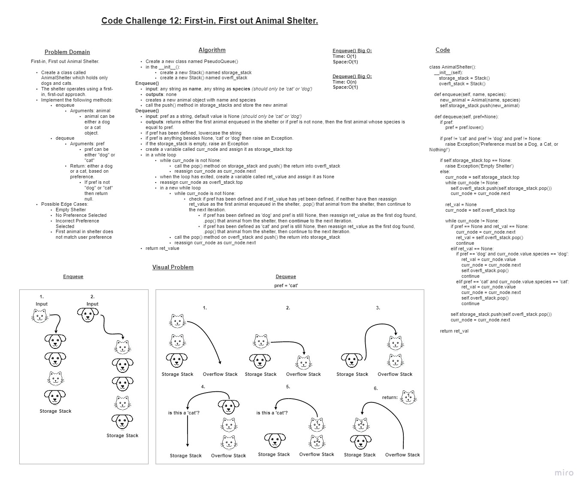

# Code Challenge 12 - First-in, First out Animal Shelter.

## Challenge

### Create a class called AnimalShelter which holds only dogs and cats.

+ The shelter operates using a first-in, first-out approach.
  + Implement the following methods:
    + enqueue
      + Arguments: animal
      + animal can be either a dog or a cat object.
    + dequeue
      + Arguments: pref
      + pref can be either "dog" or "cat"
      + Return: either a dog or a cat, based on preference.
        + If pref is not "dog" or "cat" then return null.
  + Stretch Goal
    + If a cat or dog isn’t preferred, return whichever animal has been waiting in the shelter the longest.

### Whiteboard

### Approach & Efficiency

+ I started by copying over Node and Stack scripts to help with importing errors. I also noticed that the previous code challenge would be a good method to use to sort through the animals.
+ With this, I could test each data structure.
+ I then started with the AnimalShelter class
  + I used a whiteboard with objects representing animals to map out what I specifically wanted to happen for each function. This made it easier to understand what to actually code.
  + I determined the code would work fairly similar to the PseudoQueue lab with the exception of some comparisons needed to account for the preference input for dequeue(). Through the whiteboard I learned that I would need a check that looks for when a return has been found to exclude that animal from being re-enqueued into the shelter again once it is dequeued.
  + I then coded basic functionality for each function.
  + I then did one last pass of each funcion, using the unit test conditions to determine edge cases.
