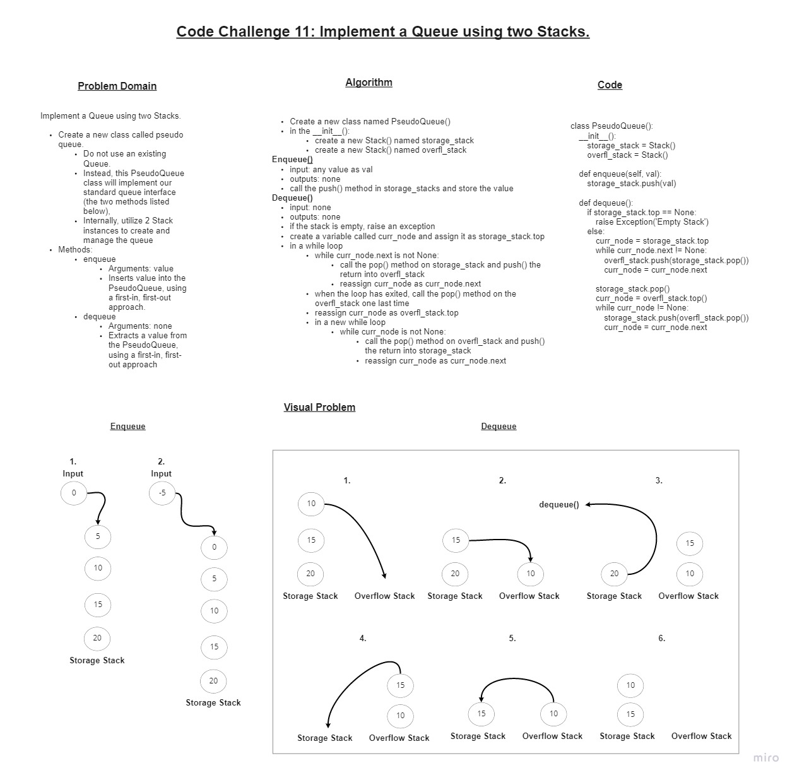

# Code Challenge 11 - Implement a Queue using two Stacks

## Challenge

### Create a new class called pseudo queue

+ Do not use an existing Queue.
+ Instead, this PseudoQueue class will implement our standard queue interface (the two methods listed below),
+ Internally, utilize 2 Stack instances to create and manage the queue
  + Methods:
    + enqueue
      + Arguments: value
      + Inserts value into the PseudoQueue, using a first-in, first-out approach.
    + dequeue
      + Arguments: none
      + Extracts a value from the PseudoQueue, using a first-in, first-out approach.

### Whiteboard

### Approach & Efficiency

+ I started by copying over Node and Stack scripts to help with importing errors.
+ With this, I could test each data structure.
+ I then started with the PseudoQueue class
  + I used a whiteboard with objects representing nodes to map out what I specifically wanted to happen for each function. This made it easier to understand what to actually code.
  + I then coded basic functionality for each function.
  + I then did one last pass of each funcion, using the unit test conditions to determine edge cases.
