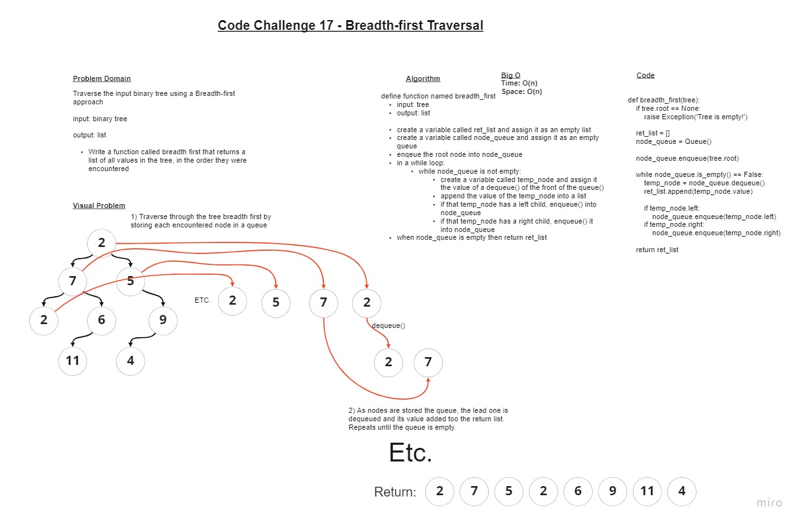

# Code Challenge 17 - Breadth-first Traversal Through a Binary Tree

## Challenge

### Write a function called breadth first

+ Arguments: tree
+ Return: list of all values in the tree, in the order they were encountered

### Whiteboard

### Approach & Efficiency

+ I started by creating a whiteboard visual to clarify what I was trying to do.
+ Essentially, I want to look at every spot in the tree in order by "rows."
+ The easiet way to do this is to start with the root and insert it into a queue. THis way, we can control the nodes we encounter by keeping them at the front of the queue.
+ Now for each node I dequeue, starting with the root, I enqueue their children from left to right. This way each row is resolved left to right.
+ As I encounter each node, I store its value in a list which I return.
