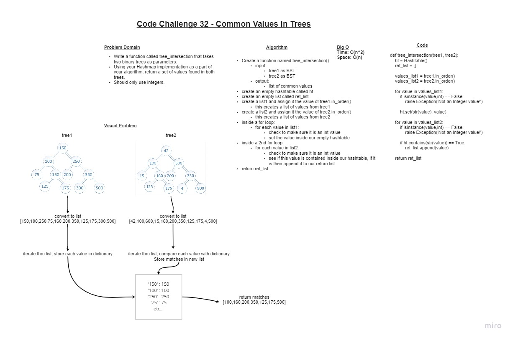

# Find common values in 2 binary trees

## Challenge

+ **Write a function called tree_intersection that takes two binary trees as parameters**
+ Using your Hashmap implementation as a part of your algorithm, return a set of values found in both trees.

## Whiteboard Process

### Approach & Efficiency

+ I started by creating the whiteboard. I was able to conceive most of the logic just in the visual alone.
+ I then had to figure out how to convert the trees to lists. Looking inside the BT class I remembered we created several ordering functions that would do it for me.
+ After that I simply had to figure out the best way to incorporate the hash table
+ Since the HT has the .contains() class function, I figured that would be the best way to quickly use the hash table to find matches since the comparison only requires one line of code.
